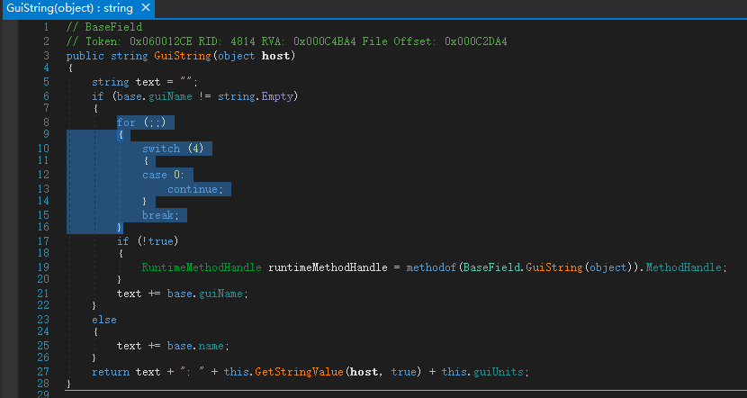
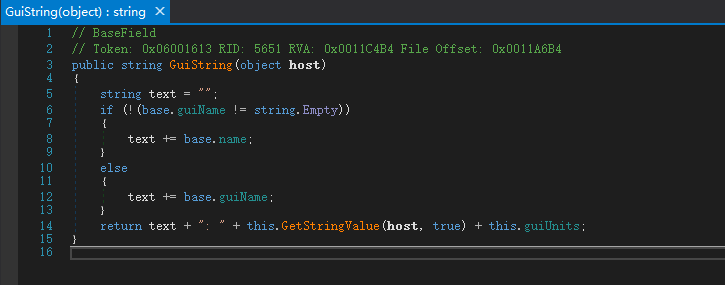

# Harmony 简单入门

> 本文面向想用 Harmony 给游戏（尤其是 Unity/Mono 游戏，如 KSP、RimWorld）写 Mod 的初学者，尽量讲清「是什么、能干嘛、怎么写」。示例使用**原生 Harmony API**（`[HarmonyPatch]` 特性 + `Harmony.Patch`），不绑定任何特定项目框架。

---

## 1. 认识 Harmony

**Harmony 是什么？**

Harmony 是一个用于 .NET / C# 的运行时方法“插桩”（method patching）库。它能在程序已经跑起来之后，动态地修改、替换、扩展已有方法的代码逻辑，**而不需要改动原始源代码或重新编译**。

简单来说，Harmony 让你做到：

- 在别人写好的方法**执行前 / 执行后**插入你自己的代码
- **拦截**方法调用：读取甚至改写它的参数、跳过它的执行、篡改它的返回值
- 在 IL（中间语言）层面**直接改写方法体**——这是最底层、最强大的方式

它非常适合**目标程序无法修改源码**的场景：闭源游戏、不再维护的 Mod、你没有源码的 DLL。

---

## 2. 三种 Patch 方式

Harmony 提供三种核心 patch，外加一个处理异常的 Finalizer（进阶）。先掌握前三个就够用大多数场景。

### 2.1 Prefix（前缀）

在目标方法**每次执行之前**运行你的代码。

它最特别的能力是**可以决定要不要继续执行原方法**：

- Prefix 返回 `true`（或不返回 `void`）→ 原方法照常执行
- Prefix 返回 `false` → **跳过原方法**（原方法不会运行）

典型用途：

- 在原方法执行前先做条件判断，不满足条件就跳过原方法
- 提前修改传给原方法的参数
- 完全替换原方法逻辑（Prefix 返回 `false`，自己把活干完）

### 2.2 Postfix（后缀）

在目标方法**每次执行之后**运行你的代码。

它**不能**跳过原方法（原方法已经跑完了），但可以：

- 读取 / 修改原方法的返回值(__result)
- 读取原方法执行后的实例状态
- 在原方法基础上追加（打日志、触发事件等）

典型用途：

- 篡改原方法的返回值（例如把返回的英文字符串换成中文）
- 原方法执行后追加自己的逻辑

此方式兼容性最佳

### 2.3 Transpiler

在 **IL（Intermediate Language，中间语言）层面**直接改写方法体。

.NET 编译后并不是机器码，而是 IL 指令，由 runtime 再翻译执行。Transpiler 拿到的就是目标方法的 IL 指令序列，你可以逐条匹配、插入、替换、删除指令。

它最强大，但也最难写、最难调试：你需要对 IL 指令有一定了解。**初学优先用 Prefix / Postfix**，只有当 Prefix/Postfix 力不从心时（比如要改的是方法体内部的一个硬编码常量、一段循环逻辑，而方法本身没有可拦截的入口/出口语义）才考虑 Transpiler。

典型用途：

- 替换方法体内写死的字符串常量（最常见的翻译硬编码文本场景）
- 修改方法体内的逻辑分支、常量数值

> 三者可以同时作用于同一个目标方法，执行顺序是：`Prefix → 原方法 → Postfix`，Transpiler 早于两者。

### 2.4 特殊注入参数

Harmony 的 patch 方法签名不用和原方法完全一致，它支持一组**约定名称的特殊参数**，按需声明即可被自动注入：

| 参数 | 可用于 | 含义 |
|------|--------|------|
| `__result` | Prefix / Postfix | 原方法的返回值。Postfix 中读取或用 `ref` 修改；Prefix 中配合 `return false` 自行赋值 |
| `__instance` | Prefix / Postfix | 原方法所属的实例 |
| `与原方法参数同名` | Prefix / Postfix | 按名称注入对应参数；加 `ref` 可修改该参数 |
| `__args` | Prefix / Postfix | 所有参数组成的数组（少用，一般用按名注入更清晰） |
| `__state` | Prefix / Postfix | 在 Prefix 里存值、Postfix 里取回，用于前后传递信息（需在 Prefix 中用 `ref`） |

> 约定：都以**两个下划线开头**，且名称必须严格匹配。返回值类型要与原方法一致（用 `__result` 时）。

---

## 3. 注意事项

- **Harmony 只对「方法」动手**。像**给类加一个新字段**、**加一个新构造函数**、**加一个新属性**都无法用 Harmony 实现——它不改类的结构，只改方法的内部逻辑。需要扩字段请考虑用伴生类 / 字典旁路存储。
- **静态构造函数（`static .cctor`）不要 patch**。静态构造函数在类型首次被访问时执行一次，且只一次。Harmony 的 patch 本身依赖类型加载，等你能 patch 上去时，静态构造函数多半已经跑完了，patch 没有意义。搞清楚 C# 类型的生命周期即可明白。
- **优先 Prefix/Postfix，慎用 Transpiler**。能用前两者解决的问题就别上 Transpiler，IL 调试成本高、且不同编译器/版本生成的 IL 可能不同，patch 容易碎。
- **patch 要尽量轻、尽量幂等**。你的 patch 会插进别人的调用链，一旦抛异常可能连累原方法乃至整个调用栈。必要时在 patch 里 `try/catch`。
- **注意 patch 的执行时机**。Harmony 是运行时改写，必须在目标方法**第一次被调用之前**完成 patch 应用。对游戏 Mod 来说，一般在插件加载入口（如 KSP 的 `[KSPAddon]`、BepInEx 的插件 `Awake`）里尽早 `PatchAll()` 或逐个 `Patch()`。

---

## 4. 反混淆（可选）

大多数情况不需要这一步。

因为 KSP 的 `Assembly-CSharp.dll` 存在部分反混淆手段，导致用 dnSpy 查看代码时会出现很多无意义的干扰代码，如下图反编译：



虽然不妨碍查看整体代码逻辑，但为了节省分析时间，可以对 `Assembly-CSharp.dll` 进行反混淆处理——当然还有一种节省时间的办法：丢给 AI。

反混淆工具很多，比如 *de4dot*、*Dotwall-deobfuscator* 等，随便选一个称手的。de4dot 最多人用，虽然要自己手动编译，但推荐。

具体反混淆流程根据自己选的工具按其说明来。

最后大概是这样：



> [!Note]
>
> **注：Take Two 明确了 "反汇编、反编译" 游戏内容会违反他们的协议，所以你最好不要到处炫耀自己的这种行为。**

---

## 5. 使用步骤

> 本节以「给一个已提供外载 DLL 入口的 Unity 游戏（如 KSP）写 Harmony Mod」为线索。对于没有外载入口的游戏（如 Subnautica），需要用 BepInEx 作为加载器，思路一样，只是入口位置不同。

### 5.1 环境准备

1. **一个 C# IDE**：Visual Studio 2022 或 JetBrains Rider，确保安装了 **.NET Framework 4.7.2** 包（KSP 可用 4.7.2；其他游戏按其运行时选择，可能是 .NET Standard 2.x / .NET 6 等）
2. **游戏本体**：你需要能拿到游戏的几个关键 DLL 作为引用
3. **Harmony 的 DLL**：通常是 `0Harmony.dll`（Harmony 2.x）。KSP 可从 [HarmonyKSP](https://github.com/KSPModdingLibs/HarmonyKSP/releases) 获取；其他游戏场景一般都可用 [Harmony NuGet 包](https://www.nuget.org/packages/Lib.Harmony)

### 5.2 创建工程与引用

新建一个 **类库（Class Library）** 工程，目标框架与游戏一致。然后添加三类引用（都设 `Private = False` / `Copy Local = False`，因为游戏运行时已经有了，不要把几十 MB 的游戏 DLL 打进你的 Mod）：

| 引用 | 作用 | 大致位置（KSP） |
|------|------|-----------------|
| `0Harmony.dll` | Harmony API | `GameData/000_Harmony/0Harmony.dll` |
| `Assembly-CSharp.dll` | 游戏主程序集（你要 patch 的目标类型大多在这） | `KSP_x64_Data/Managed/Assembly-CSharp.dll` |
| `UnityEngine.*.dll` | Unity 引擎 API | `KSP_x64_Data/Managed/` |

一个最小 `.csproj` 引用片段（KSP 示例，路径换成你自己的）：

```xml
<ItemGroup>
  <Reference Include="0Harmony">
    <HintPath>C:\KSP\GameData\000_Harmony\0Harmony.dll</HintPath>
    <Private>False</Private>
  </Reference>
  <Reference Include="Assembly-CSharp">
    <HintPath>C:\KSP\KSP_x64_Data\Managed\Assembly-CSharp.dll</HintPath>
    <Private>False</Private>
  </Reference>
  <Reference Include="C:\KSP\KSP_x64_Data\Managed\Unity*" Private="False"/>
</ItemGroup>
```

> 工程文件里含本地路径，**不要提交到仓库**（`.gitignore` 忽略 `*.csproj`/`*.sln`）。各自按自己机器配置。

### 5.3 加载并应用 Harmony

游戏启动时，需要有一个入口让你的代码跑起来，并在那时应用所有 patch。KSP 的标准入口是 `[KSPAddon]` 特性标记一个 `MonoBehaviour`：

```csharp
using HarmonyLib;
using UnityEngine;

[KSPAddon(KSPAddon.Startup.Instantly, once: true)]
public class MyModEntry : MonoBehaviour
{
    public void Start()
    {
        // 1. 创建一个 Harmony 实例(给它一个唯一ID，一般用 "作者.Mod名")
        Harmony harmony = new Harmony("com.yourname.mymod");

        // 2. 应用 patch —— 两种常见写法：
        //    (a) 自动扫描当前程序集里所有带 [HarmonyPatch] 的类
        harmony.PatchAll();

        //    (b) 或手动逐个指定(更可控，本项目即采用这种)
        // harmony.Patch(
        //     original: AccessTools.Method(typeof(TargetClass), "TargetMethod"),
        //     prefix:   new HarmonyMethod(typeof(MyPrefixPatch), nameof(MyPrefixPatch.Prefix))
        // );

        Debug.Log("[MyMod] Harmony patch 全部应用完毕");
    }
}
```

> 关于 `MonoBehaviour` 的生命周期：`Awake()` 在 GameObject 实例化 Component 后执行一次，早于 `Start()`；`Start()` 在 Component 第一次启用时执行一次。`Update()` 每帧调用，`OnDestroy()` 销毁时调用。详见 Unity 官方文档。

`PatchAll()` 会扫描调用它的程序集中所有标注了 `[HarmonyPatch]` 的类并自动应用，写起来最省事；手动 `Patch()` 则一个一个配对，更显式可控。两种可以混用。

### 5.4 编写 Patch

见下一节的三个场景示例。

---

## 6. 代码示例

下面三个例子都用**原生 Harmony API**（`[HarmonyPatch]` 特性方式），主题是通用游戏 Mod 场景：拦截燃料消耗、改写显示名、替换硬编码字符串。

> 以下示例中的「目标类」是假设的游戏内类，实际写 Mod 时，你需要先用 dnSpy / ILSpy 反编译目标 DLL，找到真实的类名、方法名和参数签名。

### 6.1 通用入口

见 [5.3 节](#53-加载并应用-harmony)的 `MyModEntry`。三个场景的 patch 类只要和它编译在同一个程序集里，`PatchAll()` 就会自动拾取。

### 6.2 Prefix 场景：拦截并控制方法执行

**目标**：假设某个游戏里有个 `FuelTank.ConsumeFuel(double amount)` 方法按量扣燃料。我们想：

- 每次扣燃料前打条日志
- 把消耗量砍半（省油外挂）
- 当 `amount <= 0` 时直接跳过原方法（避免无意义调用）

```csharp
using HarmonyLib;
using UnityEngine;

// 假设游戏里的目标类长这样：
// public class FuelTank
// {
//     public double currentFuel;
//     public virtual double ConsumeFuel(double amount) { currentFuel -= amount; return currentFuel; }
// }

[HarmonyPatch(typeof(FuelTank), nameof(FuelTank.ConsumeFuel))] // 支持使用 nameof 就尽量使用 nameof，否则直接 "ConsumeFuel"
class FuelTank_ConsumeFuel_Patch
{
    // Prefix 在原方法执行前运行。
    // - 参数名 "amount" 与原方法参数同名 → Harmony 自动获取原参数
    // - 加 ref → 可以修改值
    // - 参数 __result 类型需要与原方法返回值一致 → 可在跳过原方法时给它赋返回值
    static bool Prefix(ref double amount, ref double __result)
    {
        Debug.Log($"[MyMod] 准备消耗 {amount} 燃料");

        if (amount <= 0)
        {
            __result = 0;   // 原方法返回值由我们决定
            return false;   // false = 跳过原方法；原方法体不会执行
        }

        amount *= 0.5;      // 砍半消耗，改的是传给原方法的值
        return true;        // true = 继续执行原方法(用改过的 amount)
    }
}
```

要点：

- `return false` 跳过原方法时，**记得给 `__result` 赋值**，否则调用方拿到的返回值是默认值（`0`/`null`）
- 想完全替换原方法逻辑：Prefix 里把活干完，`return false` 即可，连 Postfix 都不用
- 只想「观察 + 微调」、不跳过：Prefix 返回 `void` 或 `true`

### 6.3 Postfix 场景：修改方法返回值

**目标**：某个游戏里 `Part.GetDisplayName()` 返回部件显示名（英文），我们想给它加上中文前缀，并在特定实例上改写。

```csharp
using HarmonyLib;

// 假设目标方法：public string GetDisplayName() => this.partName;

[HarmonyPatch(typeof(Part), "GetDisplayName")]
class Part_GetDisplayName_Patch
{
    // Postfix 在原方法执行后运行，不能跳过原方法，但能改返回值。
    // - __instance: 原方法所属实例(实例方法才有)，可读原对象的字段/属性
    // - ref string __result: 原方法返回值，加 ref 才能修改它
    static void Postfix(Part __instance, ref string __result)
    {
        // 给所有部件名加前缀
        __result = "[汉化] " + __result;

        // 也可以按实例的字段做条件判断
        if (__instance.partName == "engineRadial")
            __result = "径向发动机(改装版)";
    }
}
```

要点：

- `__result` 必须**加 `ref`** 才能改；不加只能读
- `__result` 的类型要和原方法返回值一致（值类型用 `ref`，引用类型也是 `ref`）
- 原方法是 `void` 时不需要声明 `__result`

### 6.4 Transpiler 场景：IL 层替换字符串常量

**目标**：某个游戏里 `GameUI.ShowGameOverText()` 内部写死了一段 `"Game Over"` 字符串显示在屏幕上。这个字符串不是返回值、也不是参数，Prefix/Postfix 根本碰不到它——它在方法体内部。这时只能上 Transpiler，到 IL 层把这条 `ldstr "Game Over"` 指令的字符串替换掉。

```csharp
using HarmonyLib;
using System.Collections.Generic;
using System.Reflection.Emit;

// 假设目标方法(反编译看到的代码)：
// public void ShowGameOverText() { Screen.Print("Game Over"); }
// 它的IL里会有一条: ldstr "Game Over"

[HarmonyPatch(typeof(GameUI), "ShowGameOverText")]
class GameUI_ShowGameOverText_Patch
{
    // Transpiler 接收原方法的IL指令序列，返回(可能被改过的)指令序列。
    static IEnumerable<CodeInstruction> Transpiler(IEnumerable<CodeInstruction> instructions)
    {
        // CodeMatcher 是 Harmony 提供的IL游标工具，比手写for循环匹配方便得多
        var matcher = new CodeMatcher(instructions).Start();

        matcher
            // 从当前位置向后找第一条满足条件的指令
            .MatchStartForward(new CodeMatch(OpCodes.Ldstr, "Game Over"))
            // 把这条指令的操作数(字符串)替换掉，并前进一行指令
            .SetOperandAndAdvance("游戏结束");

        return matcher.InstructionEnumeration();
    }
}
```

要点：

- `CodeMatcher` 是写 Transpiler 的利器：`MatchStartForward(...)` 向后找、`SetOperandAndAdvance(...)` 改操作数并前进、`InsertAndAdvance(...)` 插入指令
- `ldstr` 是「加载字符串常量」的 IL 指令，翻译硬编码文本时绝大多数情况都在和它打交道
- 改完后用 `InstructionEnumeration()` 把指令迭代序列交还给 Harmony
- **调试 Transpiler**：可以在方法里使用 `foreach` 打印每条指令的 `opcode` 和 `operand` 对照，或开启 `Harmony.DEBUG = true` 让 Harmony 把 patch 前后的 IL 写到日志/文件

> Transpiler 的难点不在 Harmony API，而在「知道原方法的 IL 长什么样」。先用 dnSpy 反编译目标方法，切换到IL视图，或者右键 -> 编辑 IL 指令进入局部 IL 视图，看清要改的那条指令的上下文，再据此写 `CodeMatch`。
>
> 改前确认那条文本不会被其他地方调用，确认逻辑后再下手

---

## 7. 调试技巧与常见坑

**调试**

- 开启 `Harmony.DEBUG = true`：Harmony 会把 patch 应用过程、生成的 IL 写到日志文件（路径见 Harmony 文档，一般是生成到桌面），是排查 Transpiler 问题的第一手段
- 在 patch 里打 log 比如 `Debug.Log`：可以确认你的 patch 是否真的被调用、调用时的参数值是什么
- 用 `AccessTools.Method(...)` 手动 patch 时，如果返回 `null` 多半是**类名/方法名/参数签名写错了**
- `PatchAll()` 没生效？确认你的 patch 类和入口在**同一个程序集**，且 patch 类拥有 `[HarmonyPatch]` 特性，以及 patch 方法为 `static`

**常见坑**

- **`__result` 没加 `ref`**：改了也不生效，因为改的是局部副本
- **Prefix 跳过原方法却没给 `__result` 赋值**：调用方拿到 `default`（数值为 0、引用为 null），引发空引用
- **patch 抛异常连累原方法**：Prefix 抛异常会中断原方法执行；必要时在 patch 内 `try/catch`，或确保逻辑稳健
- **patch 时机太晚**：如果在某个方法已经被 JIT 并大量调用之后才 patch，理论上 Harmony 仍能改，但最好在游戏启动早期就完成 patch，避免漏掉早期调用
- **目标方法是泛型方法 / 有重载**：用 `AccessTools.Method(typeof(T), "Name", new[]{ argType1, argType2 })` 指明参数类型数组来消歧义；`[HarmonyPatch]` 也支持指定参数类型
- **想 patch 的是私有方法**：Harmony 默认能访问私有成员，`AccessTools` 会处理反射，不用额外操作

**进阶**

- **Finalizer**：第四种 patch，用来拦截原方法的异常。签名 `static Exception Finalizer(Exception __exception)`，返回 `null` 表示「吞掉异常」，返回异常则重新抛出。适合给爱崩的方法兜底
- **多个 Mod patch 同一方法**：Harmony 会按优先级（`HarmonyPriority` / `Priority`）和 patch ID 串联多个 patch，一般不用操心；但若 patch 之间有顺序依赖，可用 `[HarmonyBefore("other.mod.id")]` / `[HarmonyAfter(...)]` 显式排序
- **动态移除 patch**：`harmony.Unpatch("id")`/ `harmony.Unpatch(original, patch)` 或者新版 Harmony 的 `UnpatchSelf()` 可移除自己应用的 patch，适用于热重载场景

---

## 参考

- Harmony 官方文档与教程：<https://harmony.pardeike.net/>
- KSP 专用 Harmony 分发：<https://github.com/KSPModdingLibs/HarmonyKSP>
