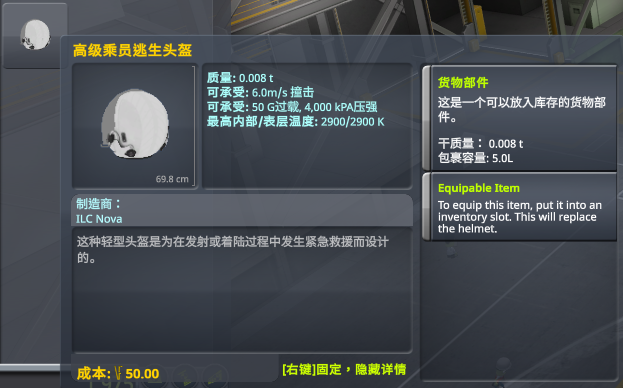
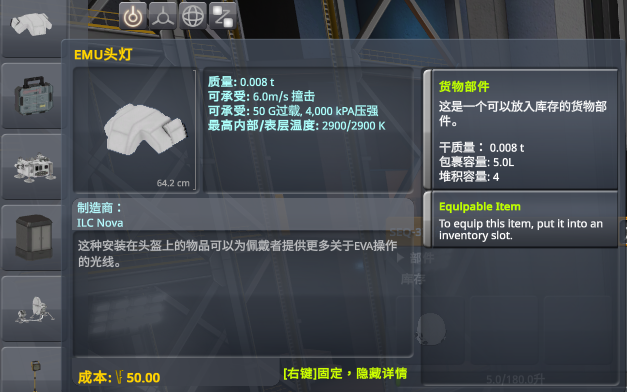
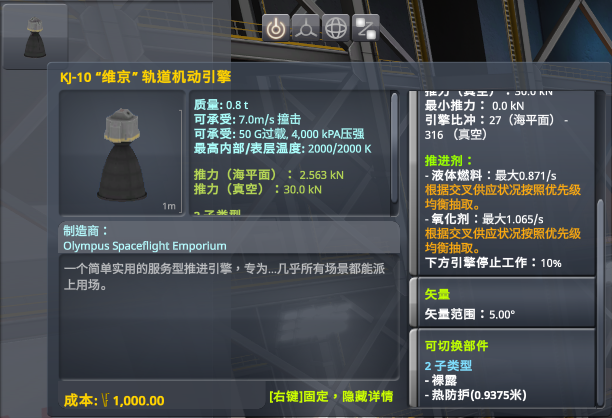
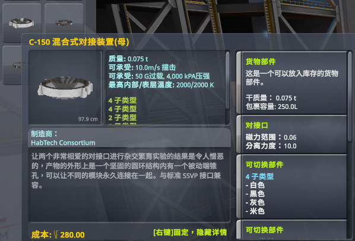
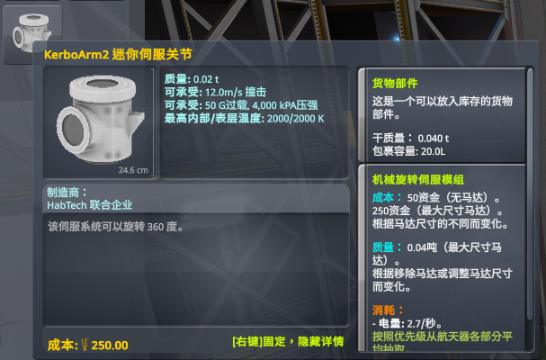
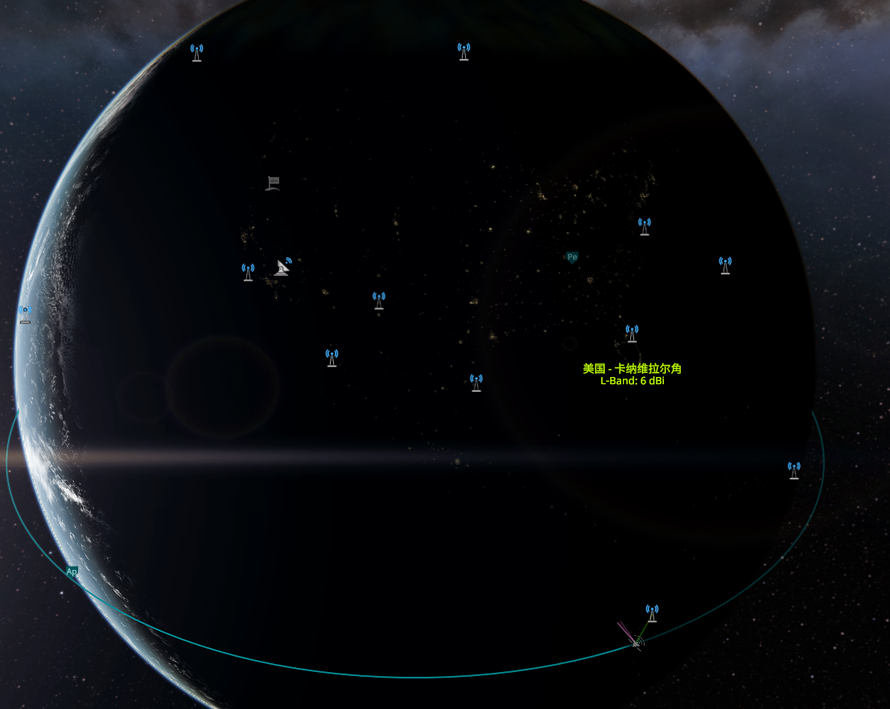
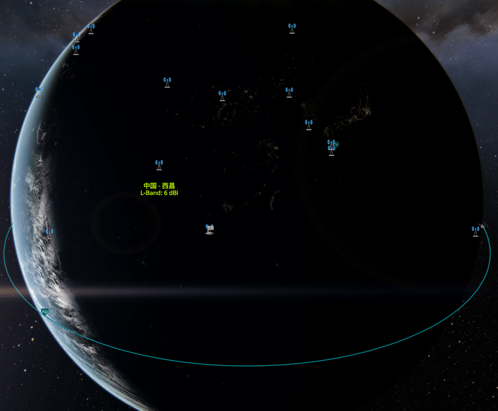

# 坎巴拉太空计划 Mod 中文翻译补丁合集 | KSP Mod Chinese Patches

A collection of Module Manager patches for translating KSP Mods (Part mods mostly) to Chinese (Simplified Chinese Only).

这是一个非常简单的 Mod ，一个 KSP 社区 Mod 的中文翻译补丁合集。里面包含了一系列部件类 Mod 的简体中文翻译、补充或修正。多数利用 Module Manager 的功能机制对部件文件中的如 `title`、`description` 等文本进行直接替换，除了少量 Mod 需要动到原文件外（会有说明），大多数翻译无需动用到 Mod 原文件。

## 下载及安装 | Download and Installation

本 Mod 在 1.12.5 游戏版本、ModuleManager 4.2.2 环境下进行编写和测试，理论上兼容任意 KSP 版本，如在其他的 KSP 版本上发现没能正确应用翻译或是与某些 Mod 一同使用时发现问题，请直接在 GitHub 页面提交一个 issue 反馈。同时本人在 B 站专门有一篇专栏文集，专门记录了本人游玩 Mod 时遇到的问题及其解决方法。传送门：[B 站专栏链接](https://www.bilibili.com/read/readlist/rl702519)

**前置 Mod** | **Required Mod**：

- **Module Manager**：[**下载链接 (Download)**](https://ksp.sarbian.com/jenkins/job/ModuleManager/lastSuccessfulBuild/artifact/)| [**官方论坛发布页(Homepage)**](https://forum.kerbalspaceprogram.com/index.php?/topic/50533-18x-112x-module-manager-422-june-18th-2022-the-heatwave-edition/)  - CKAN 有下载，如已安装可忽略，如未安装请先安装，该前置是否安装决定了本汉化合集是否生效，本项目的发布文件中不包含 MM 本体
- **Hamony**：[**下载链接 (Download)**](https://github.com/KSPModdingLibs/HarmonyKSP/releases)| [**GitHub发布页面(Homepage)**](https://github.com/KSPModdingLibs/HarmonyKSP)  - CKAN 直接搜索 **Harmony**，如已安装可忽略，如未安装请先安装。*该前置影响 Mod 硬编码文本的汉化

**安装 | Installation**

**手动安装：**

- **到本页面右侧的 [release 页面](https://github.com/tinygrox/KSP_Chinese_Patches/releases) 下载` *.zip`文件**| **Go to the [release](https://github.com/tinygrox/KSP_Chinese_Patches/releases) and download the \*.zip file**
- **将下载的文件解压到 KSP 游戏根目录下的 `GameData` 文件夹内** | **Open the \*.zip and copy ~~Tinygrox_CNPatches~~ 0000Tinygrox_CNPatches folder into `GameData` folder of your KSP installation**

完整路径应该为`X:\...\Kerbal Space Program\GameData\Tinygrox_CNPatches`，X 为你的安装分区。

**CKAN 安装：**

- **直接在 CKAN 搜索**【Chinese Mod Patches】然后选中安装即可

## 目前支持的 Mod | Mods Support

带`*`意为在当前项目中**不能将其完全**翻译，请到本项目文件夹内对应文件夹内查看说明文件(如果有的话)

列表采用 CKAN 内的显示名称

---

- **CommunityResourcePack** - 补充了 ResourceLode 、 Aerozine50 、avGas 和 Hydyne 的中文翻译；修复了将 氮气（ Nitrogen）翻译成液态氮的错误；将Hydrazine的原翻译【联氨】更为【联氨(肼)】 
- **Benjee10 Suits\*** - 部件翻译和 2 个航天服的名称翻译
- **Benjee10 sharedAssets** - 部件翻译
- **ht Robotics** - 部件翻译
- **Planetside Exploration Technologies** - 部件翻译 + 设置菜单翻译，~~看说明文件~~ 硬编码文本已翻译(需要 Harmony)
- **HabTech2** - 部件翻译
- **Moldavite Machines** - 本地化简中补充
- **Extraplanetary Launchpads\**** - 简中补充
- **SpaceAge** - 本地化简中补充，少量文本未翻译，不想翻了
- **NearFutureAeronautics** - 本地化简中补充
- **Near Future Spacecraft** - FL-T6000服务燃料箱、FL-T9000服务燃料箱2个部件的舱盖动作翻译补全，解决强迫症
- **CSI Tech Tree** - 本地化简中补充，可能存在漏翻，目前本人正在使用 **Un Kerballed Start** 科技树，遇到翻译问题反馈
- **BamedPowerStandalone** - 本地化简中补充
- **James Webb For Kerbal** - 部件翻译
- **Kerbal Weather Project** - 本地化简中补充，存在少量未翻译，详见其.cfg文件| 该 Mod 疑似会导致 UI 错位（与翻译无关），强迫症谨慎使用。
- **KerbalActuators\*** - 部件翻译，插件未翻译
- **ReStock+** - 本地化简中补充。（后续添加的新部件）
- **Un Kerballed Start** - 本地化简中补充，附有 Kerbalism 新部件在科技节点位置修复 patch
- **Real Solar System** - 本地化简中补充和一些 mod 如 RemoteTech 、realantennas 的地面站点翻译。注：该 mod 的翻译 patch 是完全手工编写，加上当时（5月11日）被坎巴拉太空计划吧官方贴吧的吧务气得不轻，可能会出现漏翻、错翻的问题，如有发现请反馈，然后等我有心情再改（碎碎念：这帮人意见不合就踢人，这我是没想到的，一句骂人的话没说就被踢了）| 如在之前已安装了 **RemoteTech** 则**需要重新载入设置**才会生效。
- **RealExoplanets** - 星球包翻译，南门二、巴纳德等各个星系中恒星、行星的名称、描述文字、生态群落的翻译，简单就是翻译了追踪站界面的右下角的信息菜单中的信息。
- **Realfuels** - 补全一些没有本地化到的地方（比如燃料箱的隔热描述）的简中翻译，附有一个可选的 patch 能够让原版的燃料箱解锁所有燃料箱类型，就像Procedural Parts 一样，详见内部【RealFuels/说明.txt】文件。
- **Advanced Jet Engine** - 根据现有的翻译对未翻译部件的文本进行翻译补全。
- **Mk2 Stockalike Expansion** - 全部件翻译，尚未进行充分校对
- **Rational Resources**  - 主Mod翻译，未包含子 Mod
  - **Rational Resources Nuclear Family(未完全)** - 一点小修饰。
  - **Rational HydroDynamics** -  将所有的 "Buoyancy" -> "浮力"
- **\*Universal Storage II Finalized** - 提供了一个初步的不完全翻译，感谢由百度贴吧用户 @CQC_S ([贴吧原贴](https://tieba.baidu.com/p/8466511187)) 提供的翻译文本，以及后续 [@yuanze31](https://github.com/yuanze31) 提供的一部分翻译修正。
- **AmpYear** - 翻译补充，Mod 涉及的造词 **Kraziness** 暂译为 **癫狂**，该词应该是 **Kraken** + **Craziness** 的结合，这个阶段没有细想到啥有趣的翻译，如果谁能想到更好的，直接提个 PR 就好，不过这个词是和另外一个Mod - [**Kabin Kraziness**](https://github.com/JPLRepo/KabinKraziness) 配套使用才会有的概念
- **DeepFreeze Continued** - 翻译修正。
- **Kerbalism** - 翻译补充，能翻译的应该都翻译了，强迫症使我这样做，目前仅翻译了原版内容，和极少量的联动 Mod 文本。0.6.0 版本开始提供了一个能翻译 Kerbalism 中的那些 Telemetry Report、Pod 等文本的 patch 文件，默认未开启，如果要体验完整的翻译请到本 mod 目录下\Kerbalism 找到 ZH_ConfiguresLoc.cfg.disable 文件，然后将后缀改为 .cfg 即可，但是开启会对旧存档的已有载具产生影响，建议**开启后新开存档**，具体说明在该文件中上方的注释处。具体翻译内容请进游戏体验，**未完全翻译**跟其他 Mod 联动的内容。
- **\*Ferram Aerospace Research Continued(FAR)** - 2 年前自用的翻译，现加入进本项目，分享给大众，仍有部分文本未翻译，说实话就是纯粹凑数用。
- **RemoteTech** - 由 [@yuanze31](https://github.com/yuanze31) 提供的翻译改进。 
- **RasterPropMonitor Core** - 2 个部件 JSI External Radial-mount Camera 和 JSI External Radial-mount Camera。
- **Kerbal Foundries2** - 部件翻译，车轮部件存在的英文来源于依赖 KSPWheel
- **Better Early Tree** - 一款科技树 Mod，在用，不能评价怎么样。
- **Kronal Vessel Viewer Continued** - 翻自己文件时找到的以前的翻译，居然还在。
- **Mk3 Stockalike Expansion** - 部件翻译。
- **SCANsat** - 由 [@yuanze31](https://github.com/yuanze31) 提供的翻译改进。
- **MechJeb2** - 一点小润
- **MOAR Station Science** - 感谢来自玩家 [@1328411791](https://github.com/1328411791) 分享的翻译
- **Squad** -  `#autoLOC_283371 = 让<<1>>摆脱重力` -> `#autoLOC_283371 = 让<<1>>过载昏迷`（英原文`Have <<1>> pass out from gee forces`）
- **JNSQ** - 星球包翻译 感谢来自玩家 [@zhangyuesai](https://github.com/zhangyuesai) 提供的翻译
- **JNSQ Real Date** - JNSQ + Kronometer 配套使用的日期格式显示 Mod，默认使用为 日月年 格式
- **Kronometer** - 用来修改日期显示格式的 Mod。
- **Tarsier Space Technology** - 太空望远镜 Mod 的翻译 由玩家 [@zhangyuesai](https://github.com/zhangyuesai) 分享提供。 
- **Quick 系列** - 该系列 Mod 的翻译均由玩家 [@zhangyuesai](https://github.com/zhangyuesai) 提供 。
  - **QuickBrake** - 发射时自动启用刹车
  - **QuickContracts** - 用键盘快捷键来接受/拒绝合同
  - **QuickExit** - 一键（保存并）退出游戏（在KSP并未完全卡死但按Esc或F5均无响应时有奇效）
  - **QuickGoTo** - 在任何场景时直接前往任何其他场景（无需回到太空中心中转）
  - **QuickHide** - 自动隐藏原版工具栏和分级控制，也可以折叠原版工具栏中不常用的模组图标
  - **QuickIVA** - 发射时自动进入舱内视角
  - **QuickMute** - 将KSP静音，或调节KSP整体音量
  - **QuickRevert** - 保存上次发射载具的回退点（发射后即使切换过场景也可回退）
  - **QuickSAS** - 使用数字小键盘切换SAS模式（稳定、机动、顺向/逆向等）
  - **QuickSearch** - 原版搜索功能改进 mod，支持科技树内按部件名搜索，这个很好用。
  - **QuickStart** - KSP启动并加载完成后自动进入上次游玩的存档
- **Astrogator** - 一个轨道窗口计算器  [@zhangyuesai](https://github.com/zhangyuesai) 
- **SpaceY 系列** - SpaceYCorp、SpaceYLifters 和 SpaceYExpanded 的支持 - [@zhangyuesai](https://github.com/zhangyuesai) 
- **Speed Unit Annex** - 一个增强了速度指示的 Mod [@zhangyuesai](https://github.com/zhangyuesai) 
- **FASA** - 一个部件包，一些仿 NASA 历代任务的航天部件，比如水星计划、探索者系列、双子座、阿波罗系列等。
- **Where Can I Go(需要Harmony)** - 一个很简单的小 Mod，会读当前载具的dv，然后告诉你当前载具可以去到哪些地方，能不能入轨、飞掠等等。
- **SmartStage(需要Harmony)** - 这个 Mod 可以自动帮你整理分级。示例场景：原版场景下，你创建了运载火箭 A 和载荷 B，分别设置好了分级，但是当你想要合并两者时，发现两者的分级顺序也自动合并了，但是合并后的分级并非以增加的方法进行，这导致了合并后分级顺序紊乱，当分级较多时，排列分级顺序将会成为一个折磨人的过程，而 SmartStage 就是为了处理了这一点，虽然不算很完美。
- **RealAntenna(需要Harmony)** - 部分玩家心心念的真实天线 Mod，现在可以翻译为中文了。翻译尚不支持 RO 环境。
- **[x] Science! Continued(需要Harmony)** - 方便科学点数查漏补缺
- **BetterBurnTime(需要Harmony)** - 一个速度指示扩展，感觉有点鸡肋
- **Background Resources** - TAC LS 和 DeepFreeze Continued 的前置，翻译了设置文本
- **Better SRBs** - 固推药柱的几种装法
- **Docking Port Alignment Indicator(需要Harmony)** - 手动对接辅助，鉴定为不如 MechJeb2 一根
- **Physics Range Extender(需要Harmony)** - 物理距离扩展
- **B9 Part Switch(需要Harmony)** - 燃料箱上的硬编码 PartInfo 等文本
- **Avionics Systems** - 翻译了此Mod包含的舱内显示器的部分页面，注意未全部翻译，只翻译了涉及了 **DE_IVAExtension** 的内容，字体使用**微软雅黑**，请确保系统有此字体，一般来说 Win10 都是自带的。 
- **ASET Consolidated Props Pack** - 翻译了部分 Prop (仪器的按钮文本等)的内容，字体同样设置为**微软雅黑**，请确保系统有安装该字体
- **HullcamVDS Continued** - 对新的摄像机部件进行翻译，以及 DLL 硬编码的 guiName 的翻译(需要Harmony)
- **Through The Eyes of a Kerbal** - 并未翻译，而是一个修复Patch，修复了一个因为这个 Mod 而导致的报错
- **RasterPropMonitor Core(需要Harmony)** - 部分联动摄像机 Mod 的 guiName 相关的翻译
- **Extraplanetary Launchpads(需要Harmony)** - 可以在其他星球搭建发射台建造火箭的Mod，Mod 很不错，但是我选择【SimpleConstruction!】。添加了内置硬编码文本的翻译
- **OrbitPOInts(需要Harmony)** - 一个能在地图界面可视化星球的引力范围、大气高度等信息的Mod
- **Resource Overview(需要Harmony)** - 轻量型资源显示器。
- **Near Future Electrical** - 补充新增的部件翻译
- **Kiwi Tech Tree Overhaul** - 科技树 Mod
- **Shuttle Orbiter Construction Kit** - 仿 NASA 航天飞机的 Mod，部件翻译，目前涉及 B9PartSwitch 的文本尚未翻译
- **System Heat** - 主Mod的翻译补全
- **VAB Organizer** - 很好的部件分类 Mod，添加了主 Mod 翻译以及同作者 如 NF 系列 Mod 的与其相关的翻译
- **Cryo Tanks** - 对自带翻译的修正，特别是“氢气”的修正，以及若干错误修正。
- **Kerballoons** - 为游戏添加 气球 部件的 Mod。部件和硬编码翻译，部分信息写死在.csv文件中，但又不想弄，就先这样将就着吧。
- **B9 Aerospace Procedural Wings - Fork** - 大名鼎鼎的 B9 自定义机翼。补充了中文翻译。
- **Kerbal GPS** - 增加代入感的 GPS 卫星 Mod，至少需要 4 颗可见 GPS 卫星才能生效。
- **Tantares - Soviet Spacecraft** - 苏联航天器mod，基本上全翻译了。 模组由[@Iftn1](https://github.com/Iftn1) 翻译
- **Tantares LV - Soviet Rockets** - 苏联和欧洲的火箭引擎。模组由[@Iftn1](https://github.com/Iftn1) 翻译
- **OPT Spaceplane 系列模组** - 著名的OPT系列模组，为你的游戏添加大量黑科技组件 模组由[@Iftn1](https://github.com/Iftn1) 翻译
  - **OPT Spaceplane (Legacy)** - 退役部件，例如尾翼机身和包含多个机翼和发动机的扩展包
  - **OPT Spaceplane Continued** - 来自OPT的“主”包。不再有旧插件捆绑包。
- **AJE Extended** - 该模组增加了大量的飞机引擎，从EF2000到福克Dr.I的引擎都包含在内。模组由[@Iftn1](https://github.com/Iftn1) 翻译
- **Historian Expanded** - 该模组为你的游戏F1截图添加了一些额外的信息显示。模组由[@Iftn1](https://github.com/Iftn1) 翻译
- **Tantares SP - Soviet Space Probes** - 该模组为你的游戏添加了一系列苏联风格（可能？）的组件。模组由[@Iftn1](https://github.com/Iftn1) 翻译
- **AlcoholicAeronautics** - 该模组为你添加了一些早期的酒精燃料的火箭发动机。模组由[@Iftn1](https://github.com/Iftn1) 翻译
- **Stockish Project Orion** - 该模组为你添加了美国猎户座计划核脉冲推进发动机。模组由[@Iftn1](https://github.com/Iftn1) 翻译

## 许可协议 | License

**CC BY 4.0**

点击上方图标可以查看该协议的完整说明，下面为主要内容简述：

#### 你可以：

- 你可以自由复制、转载、分享本 Mod
- 你可以自由对本 Mod 内容进行修改，或以此基础上进行二次发布，可用作任何用途，甚至是商业目的

注：“自由” 代表无需与本人进行联系即可进行复制、转载、分享、二次发布等操作，I dont fucking care.

#### 但必须要：

- **署名**：你必须要提供一个指向本项目的链接，同时在旁边标注署名，署名请使用名称 tinygrox，例如【来源：tinygrox | GitHub 链接页面：*链接*】。

  注1：如果用于商业性活动，你必须告知用户可以从这里获取到该项目免费的版本，同时标注是否对原始作品（即本项目）作出了修改。

  注2：署名方式任意，但必须表明你的二次发布项目并非原始项目，任何经由你的修改而产生的问题都应该由你个人维护，而非本人。

  注3：署名中请勿暗示许可人（即本人）知晓或赞同了你的项目，请不要使用类似 “本项目经由原作者 tinygrox 授权发布” 等措辞来进行署名。

- **无额外限制**：你不得通过法律手段或其他技术限制来阻止他人做协议范围内允许做的事。

  注：例如，你不得通过技术手段阻止用户接触到本免费项目，强迫他人使用你的收费版本。

## 问题 | Questions

- **Q：为什么不采用本地化的方式为 Mod 提交一个 PR 而采用这种形式？**

  A：相当多的 mod 作者进入了不活跃状态。很多时候提了一个 PR 上去几年了都没有任何答复，甚至直接被无视，且存在相当多的部件类 Mod 没有上传到 GitHub ，从而也无法提交 PR。

- **Q：能否翻译 xxx ？**

  A：目前已翻译的 Mod 都是我当前【在用】或【曾经用过】的 Mod，如果需要添加对某个 Mod 的翻译，最好的情况下是自己做好一个翻译（可以是本地化文件也可以是一个 patch 文件），然后提交一个 PR（Pull a request） 到此处。当然你也可以直接提交一个 issue ，不过这将视 Mod 工作量而考虑是否添加。

- **Q：这个 Mod 会不会有兼容性的问题？**

  A：理应无。但如果你发现了任何由于安装了本翻译补丁而产生的兼容性问题，请提出。
  
- **Q：性能问题？**

  A：~~因为翻译的主要实现是通过 Patch，所以关于性能问题，理论上只会增加游戏开始时的加载时间（且这是由 MM 决定的），一旦加载完毕，进入游戏后**理应**不会产生任何性能问题。~~自 1.0.0 版本本项目加入了 DLL 翻译功能(需要配合Harmony)，所以一定会增加游戏开始加载时间，且 DLL mod 安装的越多，时间越长，至于进入游戏后的性能问题，视 Mod 的代码情况而定，不能保证未来绝对不会出现性能问题，会尽可能避免性能问题。
  
- **Q：如何保证 MM patch 语法的正确度？**

  A：本 mod 大多数 Patch 都使用了工具自动生成，只有少数 Patch 是手动编写，虽然工具功能尚未成熟，但正确率应该……可以吧。在采用手动方式编写的 Patch 中，我通常利用 VS Code 的 KSPCFG 插件和正则表达式搜索来排错，例如，可以在 VS Code 搜索框输入`^[ ]*[^@][a-z]+`来匹配任意未以`@`操作符开头的字符串，定位到问题节点。
  
- **Q：为什么有些 Mod 不能完全翻译？**

  A：有些 Mod 需要更改代码重新编译才能完全翻译，如强迫症需完整翻译，请到相应 Mod 的文件夹内查看说明文件，在`Tinygrox_CNPatches`文件夹内，对应的 Mod 名称按 CKAN 中的显示名称命名。
  
- **Q：你这里的翻译好像不对啊？**

  A：那我只能说个人能力有限，有很多地方实在是不知道怎么翻译，考虑到中英文化差异，再综合个人的当前水平，只能如此。如能提供更好更地道的翻译，欢迎来提 PR

## 贡献 | Contribute

- **如何为本项目出一份力？**

  出力的形式多种多样，你可以选择：
  
  * **捐赠** | 疯狂给我打钱 -> 
  * **提交一份 PR** | 如果是刚接触 GitHub 不久，不知道如何开始，建议查看 [GitHub官方文档 - Pull requests](https://docs.github.com/en/pull-requests) 和相关内容，主要学会从 `fork` 到 `Create a pull requests` 
  * **问题反馈** | 反馈问题时请**至少**附上自己的 mod 列表，还有位于 `GameData` 下的 `ModuleManager.ConfigCache` 文件，详见[问题反馈](REPORT.md)

## 已知问题 | Known isuues

翻译而已，能有啥问题。

- 本汉化会覆盖所涉及 Mod 的自带汉化(如果有的话)，对于那些想要手动修改 Mod 翻译文件的玩家，请注意这一点。

## 如何汉化坎巴拉的 Mod

可查看我写的这篇大纲：https://github.com/tinygrox/KSP_Mod_Localization_Project

## 一些预览 | Previews

一些部件 Mod 的翻译：

**RSS + RealAntennas 下的地面站翻译**

